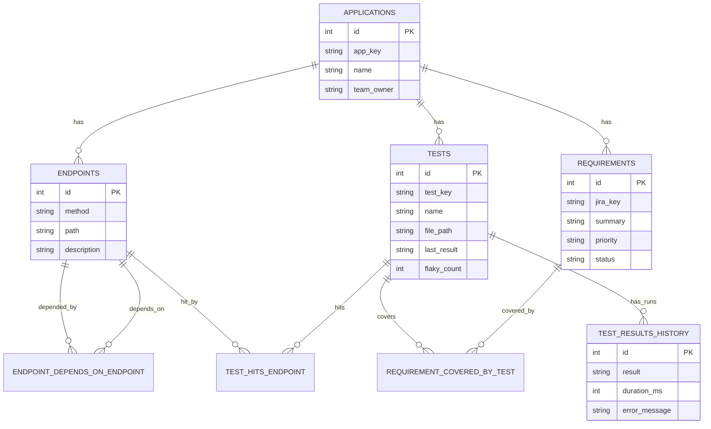
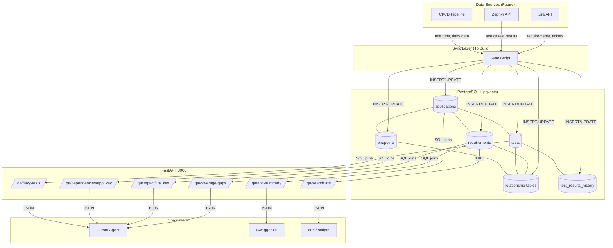
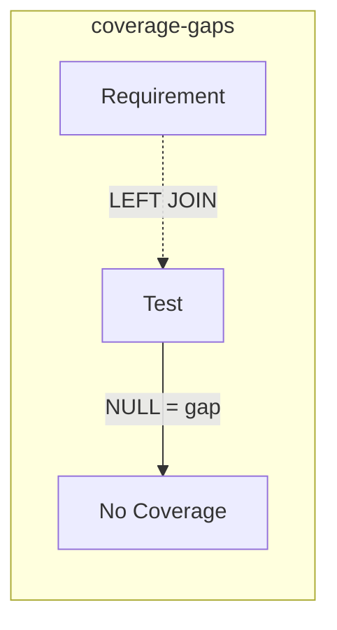
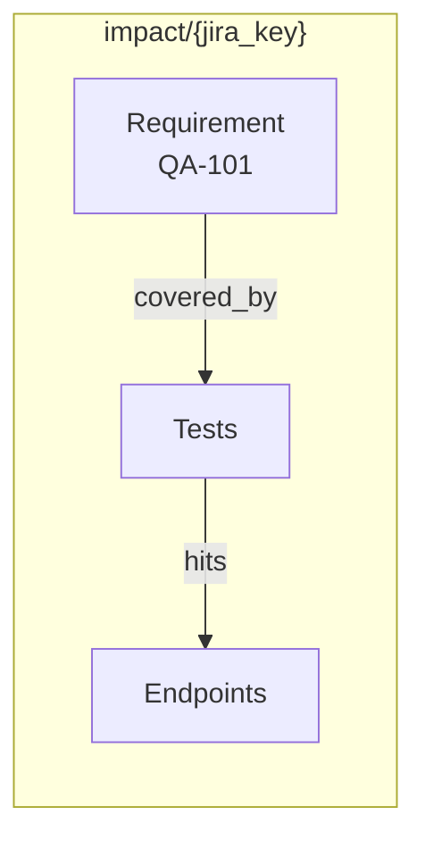
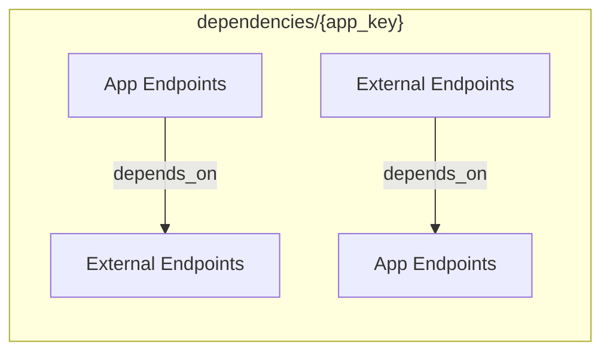
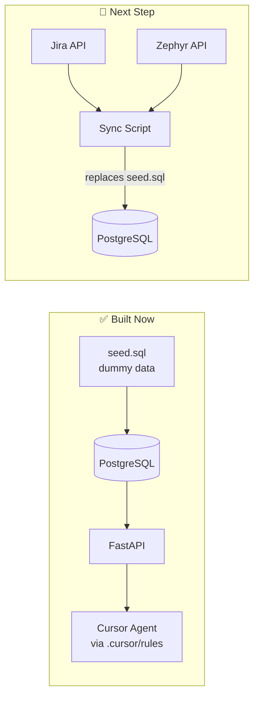

# QA Knowledge Graph — Architecture Diagrams

## 1. Entity-Relationship Diagram (Knowledge Graph Schema)

## 2. Data Flow Diagram

## 3. Graph Traversal — How Queries Walk the Graph

## 4. Current vs Future State

