# QA Knowledge Graph — Architecture Diagrams

## 1. Entity-Relationship Diagram (Knowledge Graph Schema)

## 2. Data Flow Diagram

## 3. Graph Traversal — How Queries Walk the Graph

## 4. Current vs Future State

```mermaid
flowchart LR
    subgraph NOW["✅ Built Now"]
        SEED[seed.sql<br>dummy data] --> PG[(PostgreSQL)]
        PG --> FAPI[FastAPI]
        FAPI --> AGENT[Cursor Agent<br>via .cursor/rules]
    end

    subgraph FUTURE["🔲 Next Step"]
        JIRA2[Jira API] --> SYNC[Sync Script]
        ZEPH2[Zephyr API] --> SYNC
        SYNC -->|replaces seed.sql| PG2[(PostgreSQL)]
    end
```

